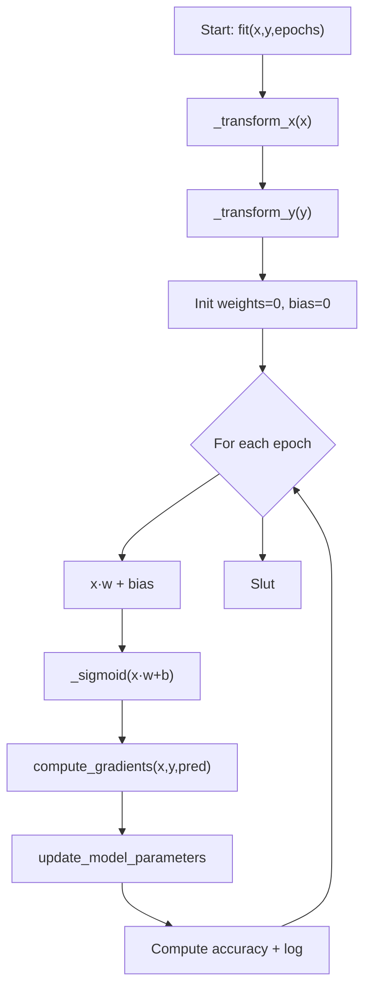
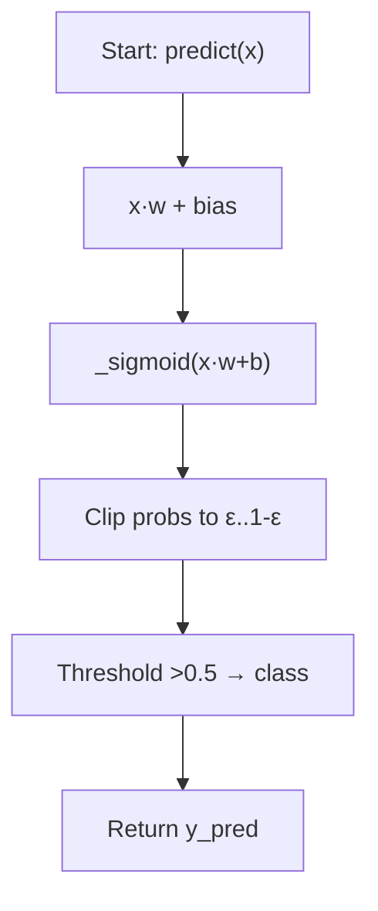
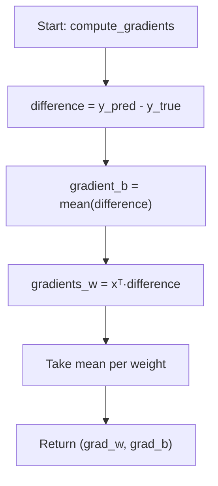
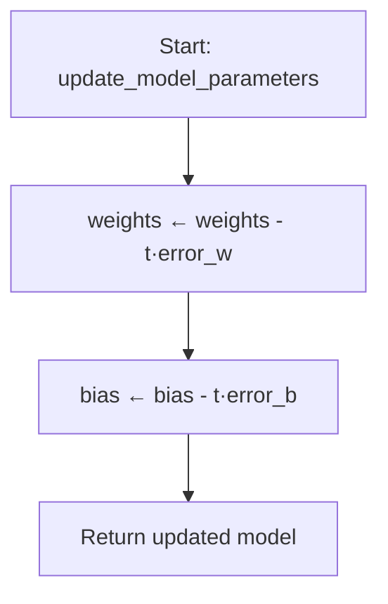
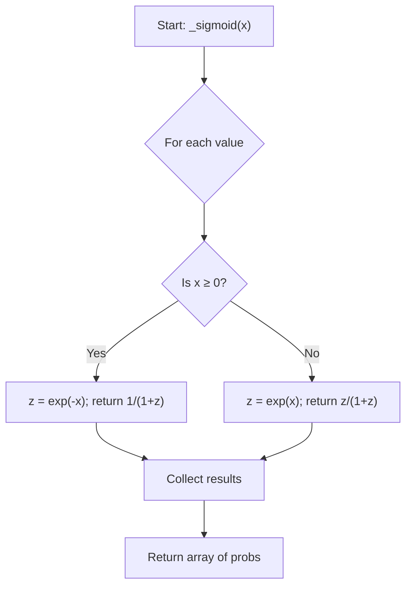
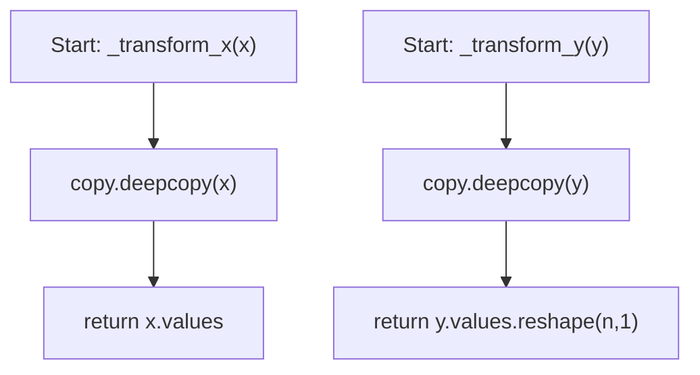

"# SOP" 

```mermaid
flowchart TD
    A["Start: fit(x,y,epochs)"] --> B["_transform_x(x)"]
    B --> C["_transform_y(y)"]
    C --> D["Init weights=0, bias=0"]
    D --> E{"For each epoch"}
    E --> F["x·w + bias"]
    F --> G["_sigmoid(x·w+b)"]
    G --> H["compute_gradients(x,y,pred)"]
    H --> I["update_model_parameters"]
    I --> J["Compute accuracy + log"]
    J --> E
    E --> K["Slut"]

```

```mermaid
flowchart TD
    A["Start: predict(x)"] --> B["x·w + bias"]
    B --> C["_sigmoid(x·w+b)"]
    C --> D["Clip probs to ε..1-ε"]
    D --> E["Threshold >0.5 → class"]
    E --> F["Return y_pred"]


```

```mermaid
flowchart TD
    A["Start: compute_gradients"] --> B["difference = y_pred - y_true"]
    B --> C["gradient_b = mean(difference)"]
    C --> D["gradients_w = xᵀ·difference"]
    D --> E["Take mean per weight"]
    E --> F["Return (grad_w, grad_b)"]


```

```mermaid
flowchart TD
    A["Start: update_model_parameters"] --> B["weights ← weights - t·error_w"]
    B --> C["bias ← bias - t·error_b"]
    C --> D["Return updated model"]

```

```mermaid
flowchart TD
    A["Start: _sigmoid(x)"] --> B{"For each value"}
    B --> C{"Is x ≥ 0?"}
    C -->|Yes| D["z = exp(-x); return 1/(1+z)"]
    C -->|No| E["z = exp(x); return z/(1+z)"]
    D --> F["Collect results"]
    E --> F
    F --> G["Return array of probs"]


```

```mermaid
flowchart TD
    A["Start: _transform_x(x)"] --> B["copy.deepcopy(x)"]
    B --> C["return x.values"]

    D["Start: _transform_y(y)"] --> E["copy.deepcopy(y)"]
    E --> F["return y.values.reshape(n,1)"]


```
